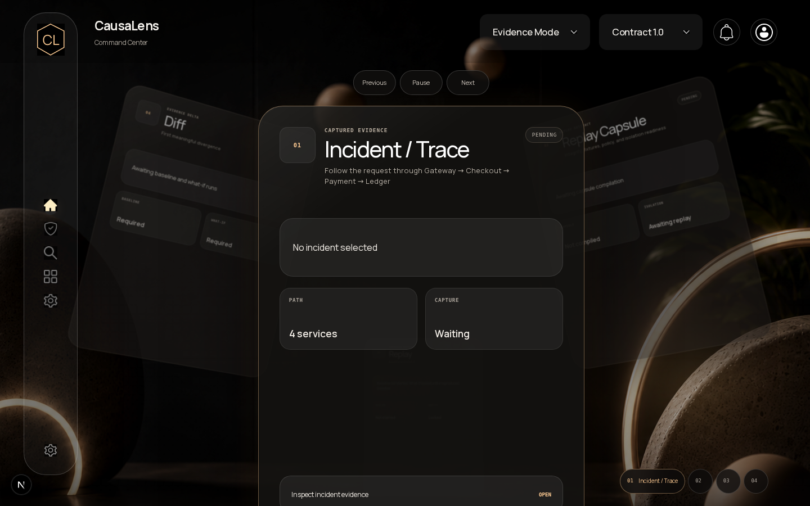
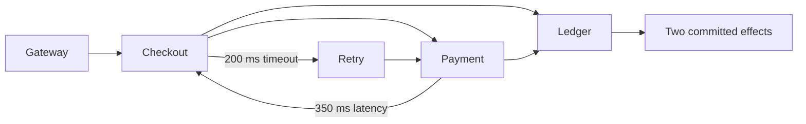
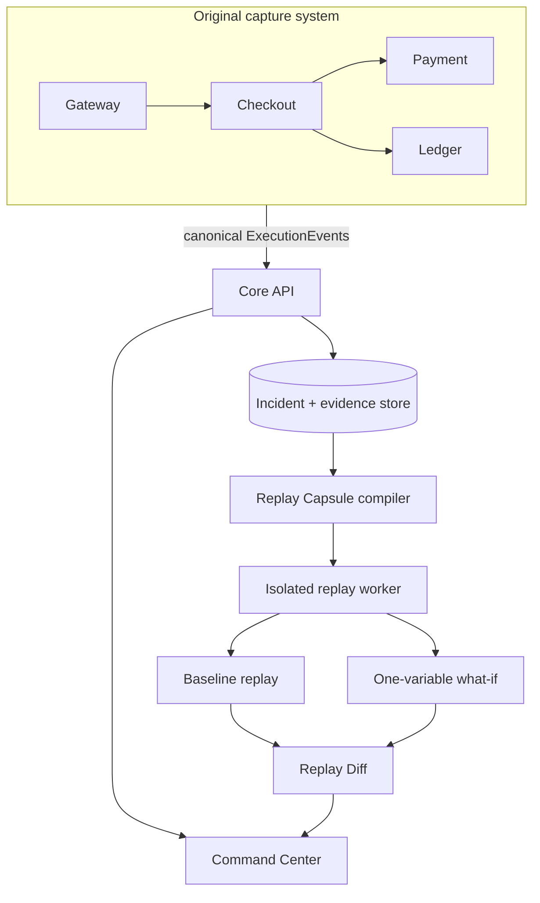

<div align="center">
  

  # CausaLens

  **Evidence-driven incident replay for distributed systems**

  Capture a failure, reproduce it safely, change one condition, and inspect the first meaningful divergence.

  [](go.mod)
  [](web/package.json)
  [](deploy/compose.yaml)
  [](deploy/compose.yaml)
  [](#project-status)

  [Quick start](#quick-start) · [Demo flow](#judge-demo-flow) · [Architecture](#architecture) · [Documentation](#documentation)
</div>

---



## Why CausaLens?

Traditional observability explains what happened. CausaLens adds a controlled reproduction loop:

```text
CAPTURE → TRACE → REPLAY → INTERVENE → DIFF
```

It records canonical execution evidence across services, detects a supported incident, compiles the minimum sanitized replay artifact, reproduces the failure inside an isolated environment, and compares that baseline with a one-variable what-if run.

### Core artifacts

- **Execution graph and timeline** — recorded ordering, parent-child relationships, attempts, effects, and evidence references.
- **Replay Capsule** — immutable replay inputs, fixtures, policies, integrity digest, replay plan, and failure oracle.
- **Isolated replay** — production credentials, data stores, and uncontrolled network access are blocked.
- **Replay Diff** — aligned events, effect-count delta, oracle delta, and first meaningful divergence.
- **System Packs** — domain-specific normalization, incident detection, fixtures, interventions, and outcome evaluation behind a stable interface.

## Judge demo flow

The working MVP demonstrates a timeout-driven duplicate ledger effect across four services:



| Stage | Expected evidence |
| --- | --- |
| Healthy control | 1 payment attempt; failure oracle stays silent; no incident |
| Faulted checkout | `exec-original-8271`; 10 graph nodes; 9 edges |
| Replay Capsule | `VALID`; contract/interface 1.0; sanitized fixtures |
| Baseline replay | `COMPLETED / REPRODUCED`; 2 payment attempts; 2 ledger commits; isolation `PASS` |
| 350 ms → 50 ms what-if | `COMPLETED / MITIGATED`; 1 payment attempt; 1 ledger commit; isolation `PASS` |
| Replay Diff | effect delta `-1 / -1`; oracle `true → false`; `PAYMENT_COMPLETES_BEFORE_TIMEOUT` |

The healthy control is intentionally separate from the deterministic golden seed, so the judge workflow still starts at `checkout-8271` after reset.

## Quick start

### Prerequisites

- Docker Engine/Desktop with Docker Compose
- At least 4 GB of memory available to Docker
- Ports `3000`, `8080`, and `18080` available

### Run the eight-service stack

From the repository root:

```bash
for service in gateway checkout payment ledger; do
  docker build -t "causalens/demo-${service}:dev" \
    -f "cmd/demo-${service}/Dockerfile" .
done

docker compose -f deploy/compose.yaml up -d --build
docker compose -f deploy/compose.yaml ps
```

Open **http://localhost:3000** and follow the [judge demo flow](#judge-demo-flow).

API smoke check:

```bash
curl -s http://localhost:3000/v1/incidents
```

PowerShell users should call `curl.exe` or `Invoke-RestMethod` instead of the `curl` alias:

```powershell
curl.exe -s http://localhost:3000/v1/incidents
```

Stop the stack:

```bash
docker compose -f deploy/compose.yaml down
```

Add `--volumes` only when you intentionally want to remove the local demo database.

## Architecture



The Docker topology keeps capture, database, and replay boundaries explicit. The replay worker can reach PostgreSQL through the internal `db` network and executes replay logic on the isolated `replay` network; it is not attached to the original capture network.

### Technology

| Area | Stack |
| --- | --- |
| Core API and workers | Go 1.26.7 |
| Command Center | Next.js 16, React 19, TypeScript, GSAP/Motion |
| Persistence | PostgreSQL 15.18, pgx |
| Runtime | Docker Compose, isolated Docker networks |
| Validation | Go tests/race detector/vet, Vitest, ESLint, TypeScript |

## Repository layout

```text
cmd/                     Go service entry points
  core-api/              Capture, incident, capsule, run, diff, and reset APIs
  replay-worker/         Isolated replay execution
  demo-*/                Gateway, checkout, payment, and ledger demo services
internal/                Contracts, capture, graph, replay, differential analysis
internal/systempack/     Domain-specific System Pack implementations
db/migrations/           PostgreSQL schema migrations
deploy/compose.yaml      Eight-service local stack and network boundaries
web/                     Next.js Command Center
docs/                    Product, contracts, architecture, safety, and demo docs
planning/                Scope and execution plans
```

## Development and verification

### Backend

```bash
go test -count=1 ./...
go test -race -count=1 ./...
go vet ./...
gofmt -l internal/replay cmd/core-api
```

`gofmt -l` should produce no output.

### Frontend

```bash
cd web
npm ci
npm run lint
npm run typecheck
npm test
npm run build
```

The frontend expects Node `20.20.2` and npm `10.8.2`, as declared in [`web/package.json`](web/package.json).

## Project status

The end-to-end hackathon MVP is implemented and verified locally:

- four instrumented demo services emit canonical execution evidence;
- Core API persists evidence and exposes incident/capsule/run/diff resources;
- the replay worker reproduces baseline and what-if executions in isolation;
- the Command Center presents capture, graph, timeline, capsule, replay, and diff evidence;
- reset and healthy-control flows keep the demo deterministic and judge-friendly.

This is a focused MVP, not a production observability platform. Current scope includes one checkout duplicate-effect System Pack and one approved latency intervention.

### Honest limitations

CausaLens does **not** currently claim:

- arbitrary replay of uninstrumented production systems;
- perfect byte-for-byte determinism;
- production credential or data access during replay;
- mathematically proven general causality;
- AI-discovered root cause; or
- replacement of logs, metrics, or distributed tracing.

## Documentation

- [Contracts and API freeze](docs/CONTRACTS.md)
- [Architecture](docs/ARCHITECTURE.md)
- [High-level design](docs/HLD.md)
- [Demo scenario](docs/DEMO_SCENARIO.md)
- [Replay Capsule](docs/REPLAY_CAPSULE.md)
- [Replay safety](docs/REPLAY_SAFETY.md)
- [Differential analysis](docs/REPLAY_DIFFERENTIAL_ANALYSIS.md)
- [System Packs](docs/SYSTEM_PACKS.md)
- [Scope](planning/SCOPE.md)

## Contributing

Contributions are welcome through focused pull requests targeting `team/integration`. Read [CONTRIBUTING.md](CONTRIBUTING.md) before submitting changes.

## Security

Replay and fixture handling cross sensitive trust boundaries. Please do not report vulnerabilities in public issues; follow [SECURITY.md](SECURITY.md) instead.

---

<div align="center">
  <strong>Evidence over inference.</strong>
</div>
